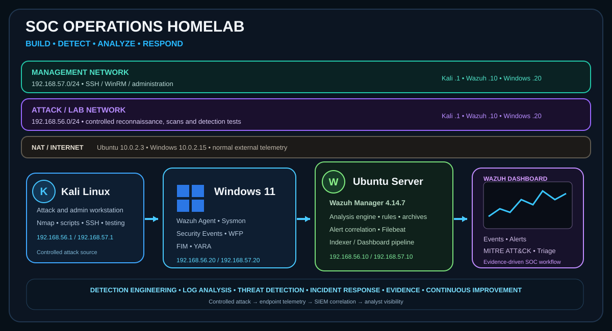

# SOC Operations HomeLab



A reproducible SOC HomeLab built with VirtualBox, Kali Linux, Ubuntu/Wazuh, and a Windows 11 endpoint. The project prioritizes verifiable detection engineering: separating telemetry from detection verdicts, reproducing controlled scenarios, and documenting engine limitations before declaring a detection valid.

## What This Lab Demonstrates

- Detection engineering with Wazuh custom rules and event correlation
- Windows Security EventChannel and Sysmon endpoint telemetry
- Network-plane separation between management, attack testing, and NAT/Internet
- False-positive reduction without globally silencing legitimate telemetry
- Real-event validation instead of relying on synthetic logtest results alone
- Evidence handling, investigation workflow and explicit documentation of engine limitations

## Detection Status

| Detection | Status | Available Evidence |
|---|---|---|
| WFP Port Scan | **VALIDATED — documented controlled run** | Historical WFP event results, `archives.json`, `alerts.json`, and NAT/MANAGEMENT negative tests; raw HomeLab logs are not published. |
| Sysmon Network / Event ID 3 | **AUDITED / PENDING VALIDATION** | EID 3 confirmed in MANAGEMENT and NAT; a real ATTACK signal required to validate the detector is missing. |
| Windows brute force | **TELEMETRY OBSERVED / PENDING DETECTION VALIDATION** | Sanitized 4625 export available; validated correlation requires a usable source IP and negative controls. |
| FIM | **CONFIGURED / REVALIDATION PENDING** | Historical test-path noise adjustment; a public package of reproducible evidence is missing. |
| YARA | **PENDING VALIDATION** | There is insufficient configuration or sanitized evidence to make an operational claim. |

## Detection Coverage Matrix

| Use case | Telemetry | Main rules | Status | Evidence |
|---|---|---|---|---|
| WFP Port Scan | Windows Security 5152/5157 | `100500–100502` | **VALIDATED — documented controlled run** | Documented WFP results and NAT/MANAGEMENT negative tests; raw logs withheld |
| Sysmon Network | Sysmon Event ID 3 | `100409`, `100420`, `100421` | **AUDITED / PENDING** | Real EID 3 telemetry in MANAGEMENT/NAT; ATTACK source event missing |
| Windows Brute Force | Windows Security 4625 | `60122` individual-failure telemetry | **TELEMETRY OBSERVED / PENDING** | Sanitized 4625 export; no validated correlation |
| File Integrity | Wazuh syscheck/FIM | No public rule ID | **REVALIDATION PENDING** | Historical configuration only |
| YARA | Intended YARA scan results | No public rule ID | **PENDING** | No public end-to-end evidence |

Detailed rule documents are indexed in the [Detection Engineering directory](detection-rules/README.md); the [evidence matrix](evidence/evidence-matrix.md) records the claim boundary for each capability.

## Curated Visual Evidence

The repository includes eight curated technical screenshots covering architecture, Wazuh, WFP, and Sysmon. They are visual evidence of specific layers, not substitutes for log artifacts: the WFP screenshot illustrates ATTACK/LAB telemetry; Sysmon demonstrates endpoint preparation, while EID 3 remains **AUDITED / PENDING VALIDATION**. See the [inventory](evidence/README.md), [evidence matrix](evidence/evidence-matrix.md), and [image catalog](evidence/image-catalog.md) for the scope of each image.

## Architecture

```text
                           Administration Plane
  Kali 192.168.57.1 ───────────────┬─────────────── Ubuntu/Wazuh 192.168.57.10
                                   │ SSH / SCP / WinRM
                                   └─────────────── Windows 11 192.168.57.20

                              Attack/Lab Plane
  Kali 192.168.56.1 ───────────────┬─────────────── Ubuntu/Wazuh 192.168.56.10
                                   │ controlled reconnaissance
                                   └─────────────── Windows 11 192.168.56.20

                              Internet/NAT Plane
             Ubuntu/Wazuh 10.0.2.3 ──────────────── Windows 11 10.0.2.15
```

| Network | CIDR | Kali | Ubuntu/Wazuh | Windows 11 | Purpose |
|---|---|---:|---:|---:|---|
| MANAGEMENT | `192.168.57.0/24` | `.1` | `.10` | `.20` | Management: SSH, SCP/SFTP, WinRM, and maintenance. |
| ATTACK/LAB | `192.168.56.0/24` | `.1` | `.10` | `.20` | Controlled reconnaissance and detection scenarios. |
| NAT/INTERNET | `10.0.2.0/24` | — | `.3` | `.15` | Updates and normal external telemetry. |

The separation prevents management or NAT traffic from being classified as lab activity. More detail: [architecture](docs/architecture/README.md).

## False-Positive Engineering: Retention Does Not Mean Alerting

```text
MANAGEMENT  192.168.57.0/24
        ↓ telemetry retained
        └── excluded from WFP scan detector

ATTACK/LAB  192.168.56.0/24
        ↓ eligible WFP telemetry
        └── 100500 → 100501 / 100502

NAT         10.0.2.0/24
        ↓ telemetry retained
        └── excluded from WFP scan detector
```

The exclusion occurs at the WFP detector base; it does not suppress MANAGEMENT or NAT telemetry from investigation files. The demonstrated negative controls apply to the WFP case, not to every future detector.

## SOC Workflow

```text
01  Generate controlled activity
02  Collect endpoint telemetry
03  Decode / normalize the event path
04  Apply base tracking rule
05  Correlate and evaluate thresholds
06  Validate against real HomeLab evidence
07  Investigate false positives / negatives
08  Document result and limitations
```

## Data Flow

```text
Windows Security / Sysmon
        -> Wazuh Agent
        -> Wazuh Manager 4.14.7
        -> archives.json (ingestion)
        -> ruleset / correlation
        -> alerts.json (alerts)
        -> Filebeat / Indexer / Dashboard
```

`archives.json` demonstrates that an event was ingested; `alerts.json` demonstrates that a rule created an alert. Dashboard visualization requires an independent indexing check.

## Detection Case Study — WFP Port Scan

### Objective

Detect controlled inbound TCP reconnaissance against Windows 11 from the ATTACK/LAB network while retaining normal MANAGEMENT and NAT telemetry.

### Telemetry path

```text
Kali 192.168.56.1
      |
      | controlled TCP reconnaissance
      v
Windows 11 192.168.56.20
      |
      | WFP 5152 / 5157
      v
Wazuh Agent
      |
      v
Wazuh Manager 4.14.7
      |
      | 100500 -> 100501 / 100502
      v
alerts.json -> Filebeat -> Indexer -> Dashboard
```

### Observed result

- **34** WFP records were produced by the validated 15-port scan.
- **15** raw destination-port values were observed.
- The Wazuh correlation rules generated exactly one local `alerts.json` alert for each threshold in the observed scan.
- MANAGEMENT and NAT negative tests remained outside the WFP detector.

The correlation is intentionally documented as a **heuristic signal**, not exact `COUNT(DISTINCT destinationPort)` logic. The full forensic sequence and cardinality analysis are documented in [WFP Port Scan Detection](detection-rules/WFP_PortScan_Detection_Final.md). Raw HomeLab logs and a direct Dashboard query are not public evidence.

## Featured Case: WFP Port Scan

The WFP detection uses inbound TCP Windows Security events `5152`/`5157`, scoped to `192.168.56.0/24 -> 192.168.56.20`.

- `100500`: silent level-6 tracking base, anchored to the Security EventChannel branch.
- `100501`: level-10 high-signal correlation.
- `100502`: level-13 high-signal correlation.

A documented real test produced 34 WFP events across 15 distinct raw destination ports and exactly one local alert for each threshold in `alerts.json`. These thresholds are **correlation heuristics**, not `COUNT(DISTINCT destinationPort)`. The results and method are published, but raw HomeLab logs are not; see the [validated WFP documentation](detection-rules/WFP_PortScan_Detection_Final.md).

## Real Technical Issues Resolved

- An official level-5 WFP rule `60104` shadowed the level-1 custom base. The validated base is level 6.
- A scan generated multiple `5152`/`5157` events per port. `ignore="60"` limits flooding without removing telemetry.
- `wazuh-logtest` with archived JSON can use a decoder different from `windows_eventchannel`; definitive validation used real HomeLab events.

## Engineering Lessons

1. A valid event does not automatically equal a valid detection.
2. A higher event volume does not necessarily imply malicious activity.
3. Separating network planes reduces false-positive pressure without removing telemetry.
4. Validation with real Windows EventChannel events is more representative than an isolated synthetic test.
5. Rules-engine limitations must be documented before interpreting a correlation counter as exact cardinality.

## Technologies

- VirtualBox
- Kali Linux
- Ubuntu with Wazuh Manager 4.14.7
- Windows 11 with Wazuh Agent and Sysmon
- Windows Filtering Platform, Windows EventChannel, `jq`, Filebeat, and Wazuh Indexer/Dashboard

## Reproducibility and Commands

The [setup guide](docs/setup/README.md) separates architecture, roles, and validation. The [historical command reference](docs/setup/08-command-reference.md) contains only commands whose execution is documented and explicitly identifies those without historical evidence.

The complete historical installation is not yet claimed as reproducible: the original installation transcripts remain outside the public repository until they can be sanitized. No installation commands are invented when they are not supported by retained evidence.

## Navigation

- [Architecture](docs/architecture/README.md)
- [Reproducible Setup Guide](docs/setup/README.md)
- [Operations and Reproduction Commands](docs/setup/08-command-reference.md)
- [Operations and Validation](docs/operations/validation-workflow.md)
- [Detection and Rule Engineering](detection-rules/README.md)
- [Evidence Matrix](evidence/evidence-matrix.md)
- [Image Catalog](evidence/image-catalog.md)
- [Troubleshooting](docs/troubleshooting/)
- [Technical Timeline](docs/timeline/project-history.md)
- [Lessons and Limitations](project-notes/)
- [Evidence Inventory](evidence/README.md)

## Project Principles

1. Do not declare a detection validated without real evidence.
2. Retain legitimate telemetry even when it is outside a detector.
3. Document rules-engine and observability limitations.
4. Do not publish keys, passwords, tokens, internal transcripts, or configurations containing secrets.

## License

This project is published under [MIT](LICENSE).
